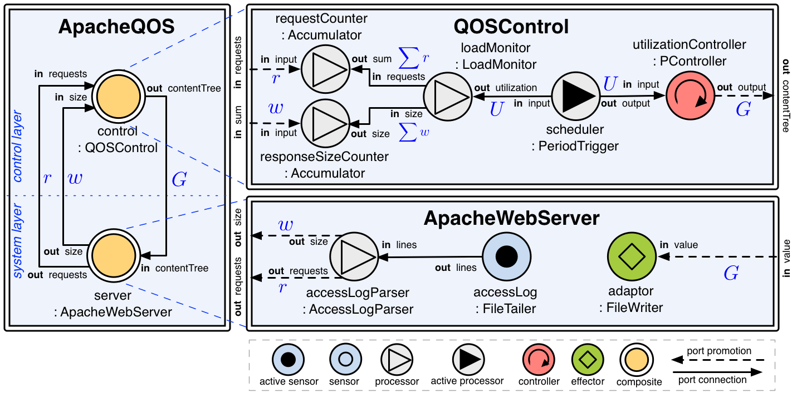
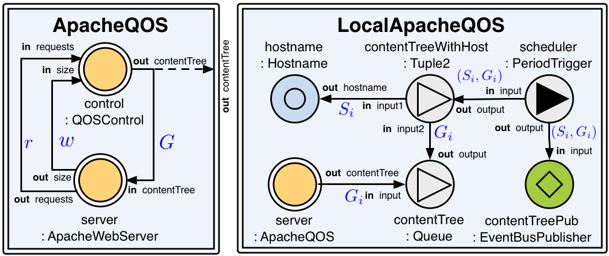
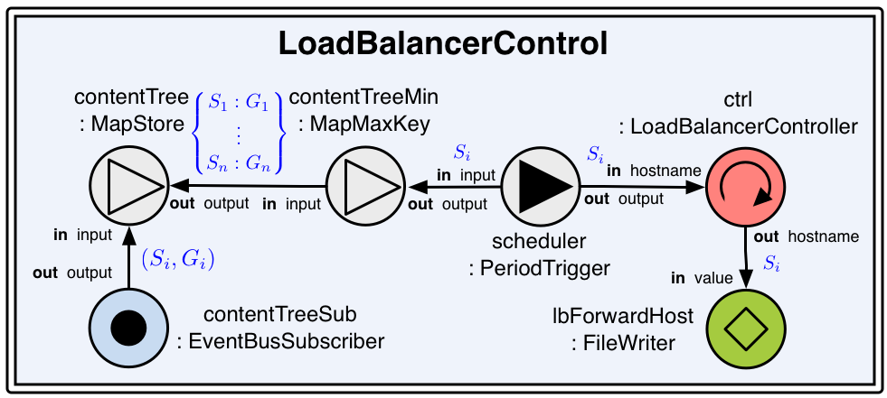
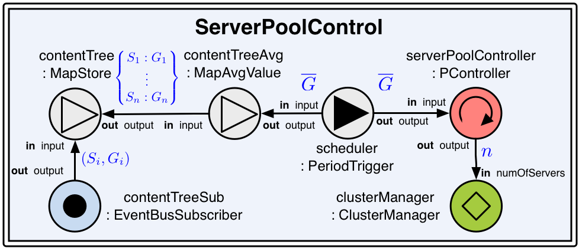
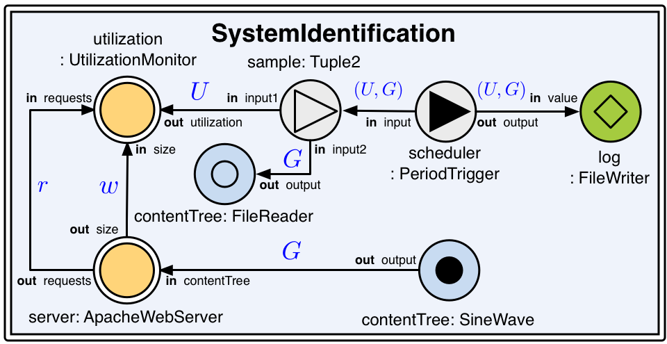
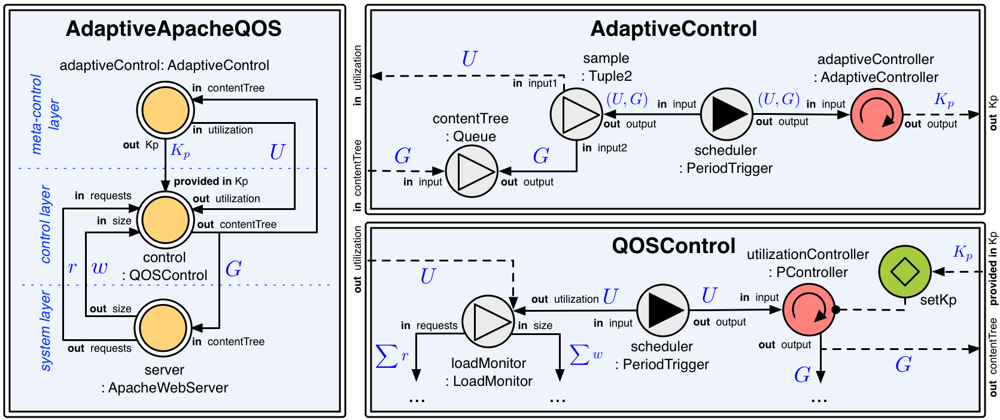

This pages contains supplementary XFCDL source of the adaptation scenarios described in our SEAMS'14 submission.

The complete FCDL and ACTRESS documentation is available in the [technical report](FCDL.pdf) (F. Krikava and P.Collet Feedback Control Definition Language. Technical report, I3S CNRS - UMR 7271, 2013).

## Preliminary

* [commons.xfcdl](SEAMS14/commons/commons.xfcdl)
    * FileTailer
    * FileReader
    * Hostname
    * PController
    * Tuple2
    * Queue
    * MapStore
    * MapMaxKey
    * MapAvgValue
    * EventBusSubscriber
    * EventBusPublisher
    * FileWriter
    * Accumulator
    * SineWave
    * PeriodicTrigger

## Local Content Delivery Adaptation

* [ApacheQOS.xfcdl](SEAMS14/cs1/ApacheQOS.xfcdl)
    * ApacheQOS
* [QOSControl.xfcdl](SEAMS14/cs1/QOSControl.xfcdl)
    * LoadMonitor
    * QOSControl
* [ApacheWebServer.xfcdl](SEAMS14/cs1/ApacheWebServer.xfcdl)
    * AccessLogParser
    * ApacheWebServer

## Distributed Content Delivery Adaptation

* [ApacheQOS.xfcdl](SEAMS14/cs2/ApacheQOS.xfcdl)
    * ApacheQOS
* [LocalApacheQOS.xfcdl](SEAMS14/cs2/LocalApacheQOS.xfcdl)
	* LocalApacheQOS
* [LoadBalancerControl.xfcdl](SEAMS14/cs2/LocalApacheControl.xfcdl)
    * LoadBalancerController
    * LoadBalancerControl

## Distributed Resource Management

* [ServerPoolControl.xfcdl](SEAMS14/cs2/ServerPoolControl.xfcdl)
    * ServerPoolControl

## System Identification

* [SystemIdentification.xfcdl](SEAMS14/cs3/SystemIdentification.xfcdl)
    * UtilizationMonitor
    * SystemIdentification

## Adaptive Control

* [AdaptiveApacheQOS.xfcdl](SEAMS14/cs4/AdaptiveApacheQOS.xfcdl)
    * AdaptiveApacheQOS
* [QOSControl.xfcdl](SEAMS14/cs4/QOSControl.xfcdl)
    * QOSControl
* [AdaptiveControl.xfcdl](SEAMS14/cs4/AdaptiveControl.xfcdl)
    * AdaptiveControl
    * AdaptiveController